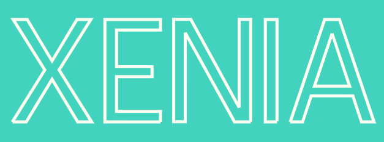
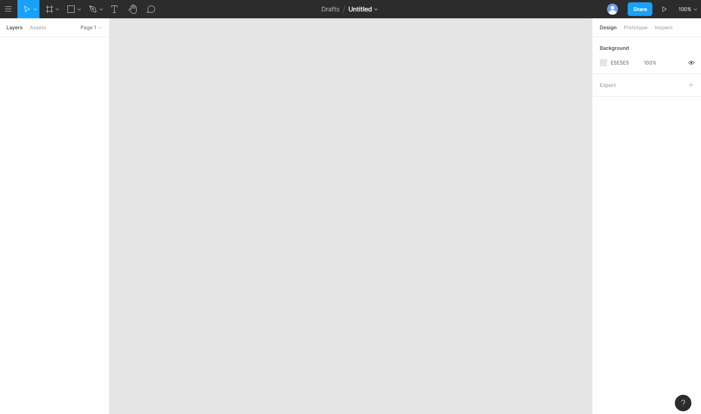
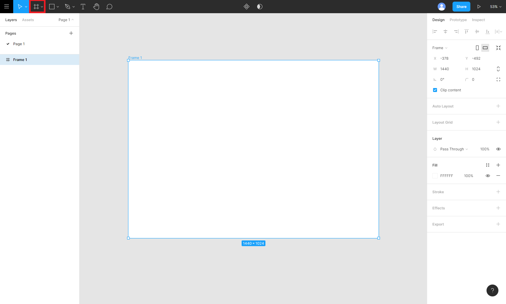
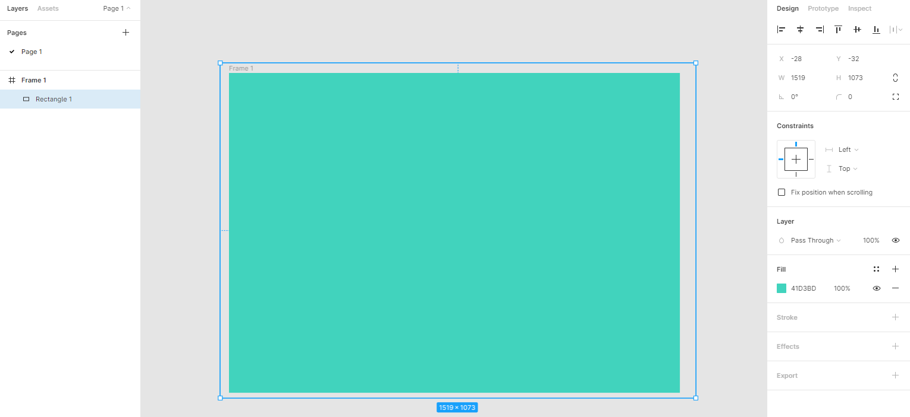
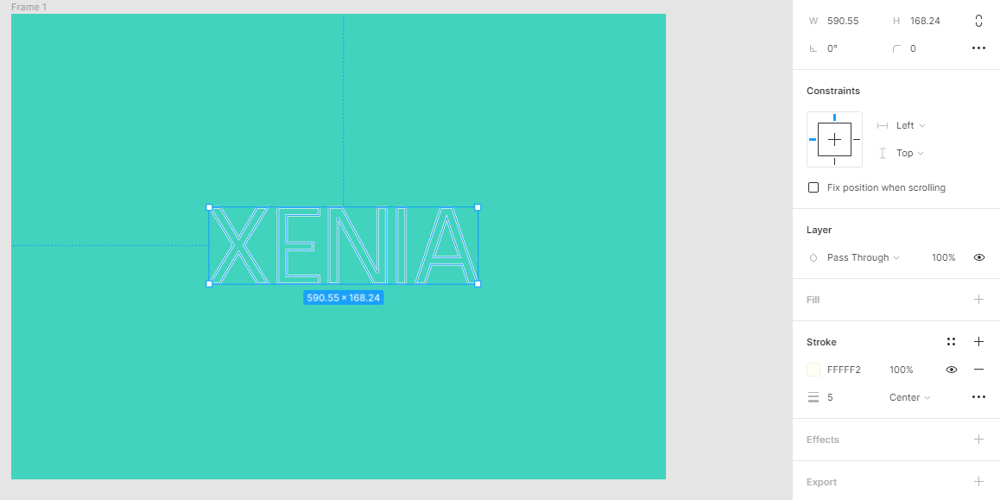
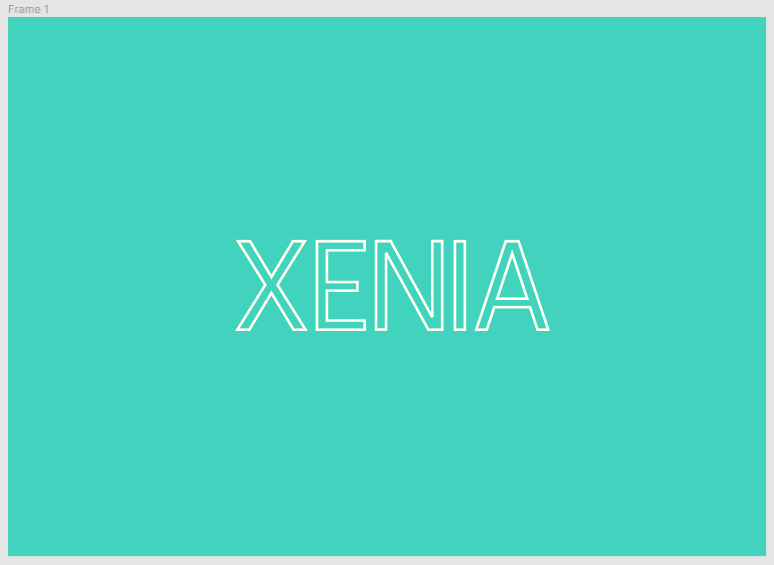
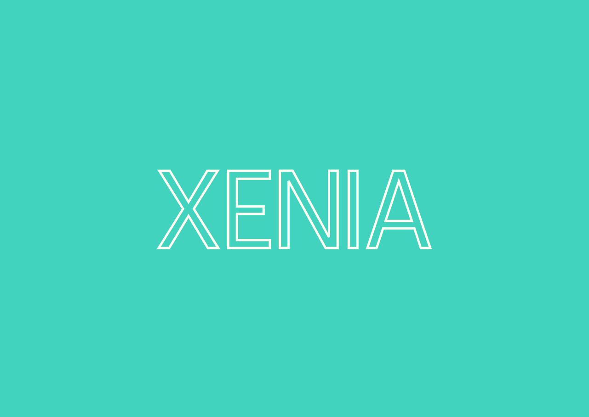
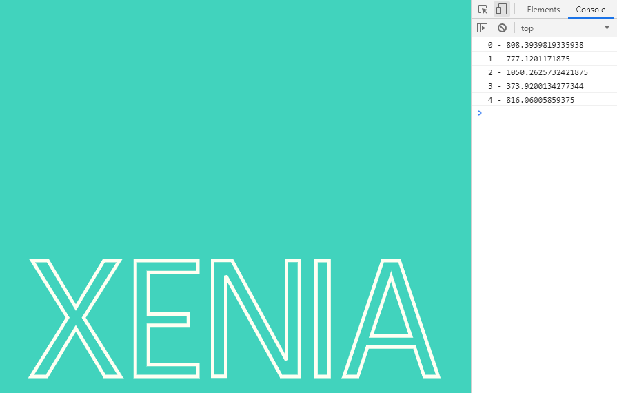

## Figma와 CSS를 이용해서 TEXT draw animation을 만들어 보자! 😃

<p align=center>
    
</p>

### Figma
1. [Figma](https://www.figma.com) 접속 후, 새 프로젝트를 만듭시다!
    <p align=center>
        
    </p>

2. 새로운 Frame을 생성해줍니다.
    <p align=center>
        
    </p>
    
    > 상단바에 있어요!

3. Frame에 사각형을 그려줍니다. 색도 채워줄게요!
    <p align=center>
        
    </p>
    
    > Frame 오른쪽에 ㅁ를 클릭 후 그려주세요

4. TEXT를 넣고 원하는 폰트를 지정해줍시다
    <p align=center>
        
    </p>

5. 텍스트에 우측 클릭 → Outline Stroke
    <p align=center>
        
    </p>

6. 우측 Design에서 Fill 부분을 삭제(-)한 후, Stroke(**Center**, 색, 굵기)를 추가해줍니다
    <p align=center>
        
    </p>
    <p align=center>
        
    </p>


7. 텍스트 우측 클릭 → Copy/Paste → Copy as SVG
    <p align=center>
        
    </p>

    ```html
    <svg width="599" height="174" viewBox="0 0 599 174" fill="none" xmlns="http://www.w3.org/2000/svg">
        <path d="M4.60001 171L57.64 85.8L6.04001 2.99998H28.84L69.4 70.92L110.2 2.99998H132.76L80.92 85.8L134.2 171H111.4L69.4 101.16L27.4 171H4.60001Z" stroke="#FFFFF2" stroke-width="5"/>
        <path d="M246.548 171H155.828V2.99998H246.548V20.28H174.788V80.52H232.868V96.84H174.788V153.72H246.548V171Z" stroke="#FFFFF2" stroke-width="5"/>
        <path d="M393.854 171H367.454L287.054 24.84V170.76H268.094V2.75998H295.934L374.894 147.24V2.75998H393.854V171Z" stroke="#FFFFF2" stroke-width="5"/>
        <path d="M436.819 171H417.859V2.99998H436.819V171Z" stroke="#FFFFF2" stroke-width="5"/>
        <path d="M458.35 171L514.51 2.99998H538.75L595.15 171H574.75L560.59 128.28H492.67L478.51 171H458.35ZM526.75 26.04L497.95 112.2H555.31L526.75 26.04Z" stroke="#FFFFF2" stroke-width="5"/>
    </svg>
    ```

---

### HTML/CSS

1. `index.html`를 생성해준 후, 위에서 만든 **svg**를 넣어줍니다! `id`값은 `logo`로 하겠습니다
    ```html
    <!-- index.html -->
    <!DOCTYPE html>

    <html>

    <head lang="ko">
        <meta charset="UTF-8" />
        <meta name="viewport" content="width=device-width, initial-scale=1.0" />
        <title></title>
    </head>

    <body>
        <svg id="logo" width="599" height="174" viewBox="0 0 599 174" fill="none" xmlns="http://www.w3.org/2000/svg">
            <path
                d="M4.60001 171L57.64 85.8L6.04001 2.99998H28.84L69.4 70.92L110.2 2.99998H132.76L80.92 85.8L134.2 171H111.4L69.4 101.16L27.4 171H4.60001Z"
                stroke="#FFFFF2" stroke-width="5" />
            <path d="M246.548 171H155.828V2.99998H246.548V20.28H174.788V80.52H232.868V96.84H174.788V153.72H246.548V171Z"
                stroke="#FFFFF2" stroke-width="5" />
            <path d="M393.854 171H367.454L287.054 24.84V170.76H268.094V2.75998H295.934L374.894 147.24V2.75998H393.854V171Z"
                stroke="#FFFFF2" stroke-width="5" />
            <path d="M436.819 171H417.859V2.99998H436.819V171Z" stroke="#FFFFF2" stroke-width="5" />
            <path
                d="M458.35 171L514.51 2.99998H538.75L595.15 171H574.75L560.59 128.28H492.67L478.51 171H458.35ZM526.75 26.04L497.95 112.2H555.31L526.75 26.04Z"
                stroke="#FFFFF2" stroke-width="5" />
        </svg>
    </body>

    </html>
    ```

2. `style.css`를 생성한 후, 스타일을 지정해줍니다!

    ```css
    *{
        padding: 0;
        margin: 0;
        box-sizing: border-box;
    }

    body{
        width: 100%;
        height: 100vh;
        background-color: #41D3BD;
    }

    #logo{
        position: absolute;
        top:50%;
        left: 50%;
        transform: translate(-50%, -50%);
        animation: fill-letters 0.5s ease forwards 2.1s;
    }
    ```

    > html head 태그 안에 넣어줍시다!

    ```html
    <!-- index.html -->
    ...
    <link rel="stylesheet" href="style.css">
    ...
    ```

    <p align=center>
        
    </p>

3. 길이 확인을 위해 `app.js`를 생성하고 아래 코드를 추가해줍니다.

    ```javascript
    // app.js
    const logo = document.querySelectorAll('#logo path');

    for (let i = 0; i < logo.length; i++) {
        console.log(`${i} - ${logo[i].getTotalLength()}`);
    }
    ```

    > html body 태그 안에 넣어줍시다!
    ```html
    <!-- index.html -->
    ...
    <script src="app.js"></script>
    ...
    ```

    <p align=center>
        
    </p>

    ```json
    예시 텍스트 : XENIA
    
    X : 808
    E : 777
    N : 1050
    I : 373
    A : 816
    ```

4. 이제 `style.css`에서 애니메이션을 만들어봅시다!

    > 글자 수 만큼 아래 코드를 생성해줍니다!
    ```css
    #logo path:nth-child(1){
        stroke-dasharray : 808;
        stroke-dashoffset: 808;
    }
    ```

    > `stroke-dasharray`, `stroke-dashoffset` 부분을 3번에서 나온 값으로 수정해줍니다
    ```css
    #logo path:nth-child(1){
        stroke-dasharray : 808;
        stroke-dashoffset: 808;
    }

    #logo path:nth-child(2){
        stroke-dasharray : 777;
        stroke-dashoffset: 777;
    }

    #logo path:nth-child(3){
        stroke-dasharray : 1050;
        stroke-dashoffset: 1050;
    }

    #logo path:nth-child(4){
        stroke-dasharray : 373;
        stroke-dashoffset: 373;
    }

    #logo path:nth-child(5){
        stroke-dasharray : 816;
        stroke-dashoffset: 816;
    }
    ```

5. 아래에 `@keyframes`을 추가해줍니다
    ```css
    @keyframes line-animation{
        to{
            stroke-dashoffset: 0;
        }
    }
    ```

6. 다음엔 각 요소에 애니메이션을 적용해줍시다
    ```css
    #logo path:nth-child(1){
        stroke-dasharray : 808;
        stroke-dashoffset: 808;
        animation: line-animation 2s ease forwards 0.3s;
    }

    #logo path:nth-child(2){
        stroke-dasharray : 777;
        stroke-dashoffset: 777;
        animation: line-animation 2s ease forwards 0.3s;
    }

    #logo path:nth-child(3){
        stroke-dasharray : 1050;
        stroke-dashoffset: 1050;
        animation: line-animation 2s ease forwards 0.3s;
    }

    #logo path:nth-child(4){
        stroke-dasharray : 373;
        stroke-dashoffset: 373;
        animation: line-animation 2s ease forwards 0.3s;
    }

    #logo path:nth-child(5){
        stroke-dasharray : 816;
        stroke-dashoffset: 816;
        animation: line-animation 2s ease forwards 0.3s;
    }
    ```

    <p align=center>
        
    </p>

7. 이제 `@keyframes`을 하나 더 추가하여 글자를 채워줍시다
    ```css
    @keyframes fill-letters{
        from{
            fill: transparent;
        }
        to{
            fill: #FFFFF2;
        }
    }
    ```

    > `fill-letters`를 `#logo`에 추가해줍시다
    ```css
    #logo{
        position: absolute;
        top:50%;
        left: 50%;
        transform: translate(-50%, -50%);
        animation: fill-letters 0.5s ease forwards 2.1s;
    }
    ```

8. 완성 ! 🎉
    <p align=center>
        
    </p>

---

**index.html**
```html
<!DOCTYPE html>

<html>

<head lang="ko">
    <meta charset="UTF-8" />
    <meta name="viewport" content="width=device-width, initial-scale=1.0" />
    <link rel="stylesheet" href="style.css">
    <title></title>
</head>

<body>
    <svg id="logo" width="300" height="174" viewBox="0 0 599 174" fill="none" xmlns="http://www.w3.org/2000/svg">
        <path
            d="M4.60001 171L57.64 85.8L6.04001 2.99998H28.84L69.4 70.92L110.2 2.99998H132.76L80.92 85.8L134.2 171H111.4L69.4 101.16L27.4 171H4.60001Z"
            stroke="#FFFFF2" stroke-width="5" />
        <path d="M246.548 171H155.828V2.99998H246.548V20.28H174.788V80.52H232.868V96.84H174.788V153.72H246.548V171Z"
            stroke="#FFFFF2" stroke-width="5" />
        <path d="M393.854 171H367.454L287.054 24.84V170.76H268.094V2.75998H295.934L374.894 147.24V2.75998H393.854V171Z"
            stroke="#FFFFF2" stroke-width="5" />
        <path d="M436.819 171H417.859V2.99998H436.819V171Z" stroke="#FFFFF2" stroke-width="5" />
        <path
            d="M458.35 171L514.51 2.99998H538.75L595.15 171H574.75L560.59 128.28H492.67L478.51 171H458.35ZM526.75 26.04L497.95 112.2H555.31L526.75 26.04Z"
            stroke="#FFFFF2" stroke-width="5" />
    </svg>

    <script src="app.js"></script>
</body>

</html>
```

**style.css**
```css
*{
    padding: 0;
    margin: 0;
    box-sizing: border-box;
}

body{
    width: 100%;
    height: 100vh;
    background-color: #41D3BD;
}

#logo{
    position: absolute;
    top:50%;
    left: 50%;
    transform: translate(-50%, -50%);
    animation: fill-letters 0.5s ease forwards 2.1s;
}

#logo path:nth-child(1){
    stroke-dasharray : 808;
    stroke-dashoffset: 808;
    animation: line-animation 2s ease forwards 0.3s;
}

#logo path:nth-child(2){
    stroke-dasharray : 777;
    stroke-dashoffset: 777;
    animation: line-animation 2s ease forwards 0.3s;
}

#logo path:nth-child(3){
    stroke-dasharray : 1050;
    stroke-dashoffset: 1050;
    animation: line-animation 2s ease forwards 0.3s;
}

#logo path:nth-child(4){
    stroke-dasharray : 373;
    stroke-dashoffset: 373;
    animation: line-animation 2s ease forwards 0.3s;
}

#logo path:nth-child(5){
    stroke-dasharray : 816;
    stroke-dashoffset: 816;
    animation: line-animation 2s ease forwards 0.3s;
}

@keyframes line-animation{
    to{
        stroke-dashoffset: 0;
    }
}

@keyframes fill-letters{
    from{
        fill: transparent;
    }
    to{
        fill: #FFFFF2;
    }
}
```

**app.js**
```js
const logo = document.querySelectorAll('#logo path');

for (let i = 0; i < logo.length; i++) {
    console.log(`${i} - ${logo[i].getTotalLength()}`);
}
```